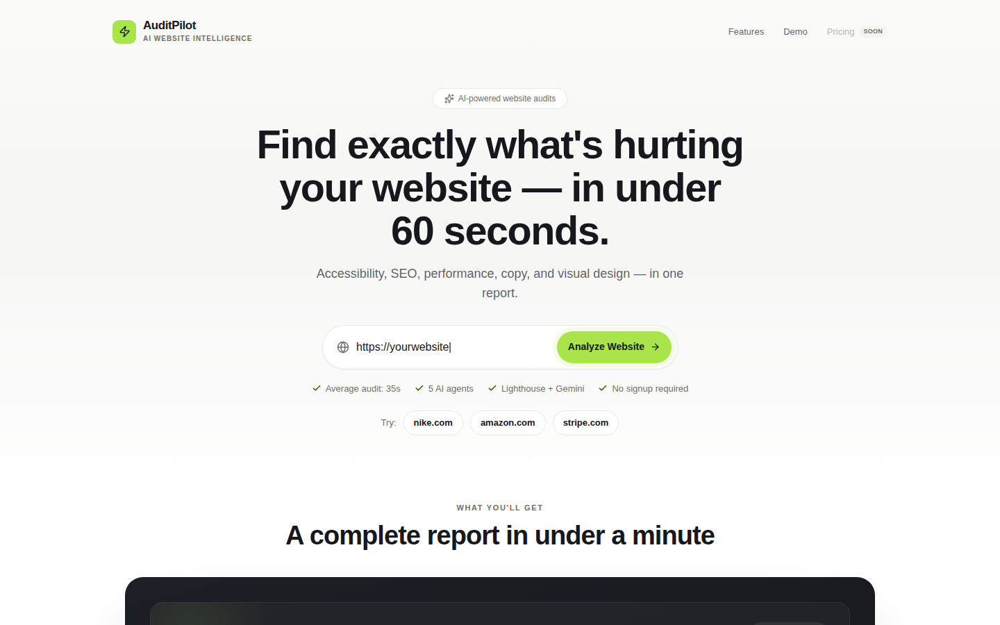

# AuditPilot

Agentic AI website auditing platform. Analyzes accessibility, performance, SEO, messaging quality, and visual design from a single URL.

**Live preview:** [audit-pilot-ten.vercel.app](https://audit-pilot-ten.vercel.app/)



## Stack

- **Frontend:** React + TypeScript + Vite + Tailwind + shadcn/ui + recharts
- **Backend:** FastAPI
- **AI:** Gemini 2.5 Flash (via the `google-genai` SDK) — text (CopyAgent) and vision (VisualAgent)
- **Scraping/Screenshots:** Playwright
- **Analysis:** Lighthouse (via `npx lighthouse`)
- **Reports:** ReportLab (PDF export)

## Structure

```
frontend/
├── src/
│   ├── pages/
│   │   ├── UrlInputPage.tsx        # Page 1 — enter a URL, starts a report job
│   │   ├── AuditProgressPage.tsx    # Page 2 — polls job status, live per-agent progress
│   │   └── AuditResultsPage.tsx     # Page 3 — Overall Score, 5 category cards, charts, recommendations
│   ├── components/
│   │   ├── ui/                     # shadcn/ui primitives (Card, Progress, Badge, ...)
│   │   └── audit/                   # OverallScoreCard, CategoryCard, CopyReviewCard, VisualReviewCard, ChartsSection, PrioritizedRecommendations
│   ├── lib/api.ts                  # createReportJob() / getReportJob() — no mock data
│   └── types/audit.ts               # TS mirror of backend/models/schemas.py
└── package.json

backend/
├── main.py                  # FastAPI app: /health, /audit, /audit/full, /report, /report/pdf, /report/jobs
├── orchestrator.py            # AuditOrchestrator — runs Accessibility/SEO/Copy in parallel; run_agent_safely() helper
├── report.py                  # ReportBuilder + combine_report() — merges all 5 agents into StructuredAuditReport
├── jobs.py                    # JobManager — background report jobs with real per-step progress, polled by the frontend
├── scraper.py                 # Playwright scraper -> ScrapedPageData
├── screenshot.py               # Playwright full-page + above-the-fold viewport screenshot capture
├── gemini_client.py            # Thin async wrapper around the google-genai SDK (text + multimodal/image)
├── lighthouse_runner.py         # Runs `npx lighthouse` and extracts Core Web Vitals
├── pdf_report.py               # ReportLab PDF generation (Executive Summary, per-category sections incl. Visual, recommendations)
├── agents/
│   ├── base.py                 # BaseAgent interface
│   ├── scoring.py               # Shared 0-100 scoring utility for rule-based agents
│   ├── accessibility.py          # AccessibilityAgent — rule-based checks
│   ├── seo.py                    # SEOAgent — rule-based checks
│   ├── copy.py                   # CopyAgent — Gemini-powered messaging analysis
│   ├── performance.py            # PerformanceAgent — Lighthouse-based
│   ├── visual.py                 # VisualAgent — Gemini vision analysis of screenshots
│   └── prompts/
│       ├── copy.py                # Prompt templates for CopyAgent
│       └── visual.py               # Prompt templates for VisualAgent
├── models/
│   └── schemas.py               # Pydantic request/response/report models (incl. ReportJob, StructuredAuditReport, VisualResult)
├── tests/                     # pytest unit tests (no network access required) — 160 passing
├── requirements.txt
└── requirements-dev.txt         # + pytest, pytest-asyncio
```

> Status: Milestones 1-11 done. All five agents (Accessibility, SEO, Copy via Gemini, Performance via Lighthouse, Visual via Gemini vision) are implemented and unit-tested. `AuditOrchestrator` + `ReportBuilder` combine them into one `StructuredAuditReport` (overall score, category scores, prioritized recommendations). VisualAgent (Milestone 11) analyzes two Playwright screenshots — the full page and the above-the-fold viewport — across visual hierarchy, CTA visibility, layout issues, and contrast problems; both screenshots are embedded in the report as base64 PNGs so the frontend can render them without a separate file-serving endpoint. Audits run as background jobs (`POST /report/jobs` + `GET /report/jobs/{id}`) with real per-agent progress tracking, so the frontend's Audit Progress page reflects actual work rather than a simulated loader. The React dashboard is a 3-page flow (URL Input → Audit Progress → Results Dashboard) with score cards (including a Visual Review card with a screenshot thumbnail), a category-score bar chart, an issues-by-severity donut chart, and a prioritized recommendations list — no placeholder data. PDF export (`POST /report/pdf`) produces a ReportLab document with Executive Summary, Accessibility, SEO, Copy, Performance, Visual (with an embedded screenshot), and Recommendations sections. One agent failing (e.g. Gemini unreachable, or screenshot capture failing) doesn't take down the whole audit — that slot just gets `score: null` with an error summary.

## Backend setup

```bash
cd backend
python -m venv .venv
source .venv/bin/activate
pip install -r requirements-dev.txt   # includes requirements.txt + pytest
playwright install chromium
uvicorn main:app --reload
```

Health check: `GET http://localhost:8000/health`

Scrape a page: `POST http://localhost:8000/audit` with `{"url": "https://example.com"}` — returns structured page data.

Run a full multi-agent audit (blocking): `POST http://localhost:8000/audit/full` — scrapes the page, runs Accessibility/SEO/Copy in parallel, returns `{overall_score, accessibility, seo, copy}`.

Get the full combined report (blocking, includes Performance): `POST http://localhost:8000/report` — returns a `StructuredAuditReport`.

Start a background report job (used by the frontend): `POST http://localhost:8000/report/jobs` with `{"url": "https://example.com"}` — returns `{job_id, status}` immediately (202). Poll `GET http://localhost:8000/report/jobs/{job_id}` for `{status, progress, result, error}` until `status` is `completed` or `failed`.

Export a PDF: `POST http://localhost:8000/report/pdf` — returns a ReportLab-generated PDF of the full audit. Accepts optional `visual` (CategoryResult) and `screenshot_viewport_base64` fields to include the Visual section with an embedded screenshot.

## Running tests

```bash
cd backend
pytest -v
```

All current tests use fakes/stubs for Playwright and Gemini, so no network access or API keys are required to run the suite.

## Environment variables

| Variable | Purpose |
|---|---|
| `GEMINI_API_KEY` | Required for `CopyAgent` to actually call Gemini 2.5 Flash. Not required to import or unit-test the agent — `GeminiClient` only checks for it on the first real API call. As of 2026, keys from AI Studio are issued as `AQ.`-prefixed "Auth keys" rather than the older `AIza...` "Standard key" format; both work with this project's `google-genai`-based client. |

## Frontend setup

```bash
cd frontend
npm install
cp .env.example .env
npm run dev
```

Open `http://localhost:5173`. Requires the backend running at `http://localhost:8000` (or wherever `VITE_API_BASE_URL` points).

## Next steps

- Delete `frontend/src/App.css` and `frontend/src/assets/*` (unused Vite template leftovers)
